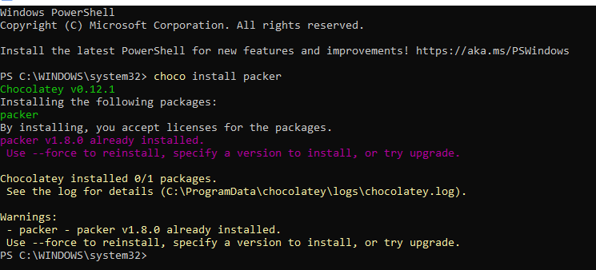
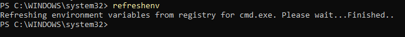
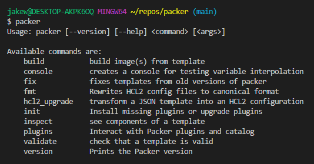
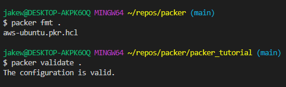
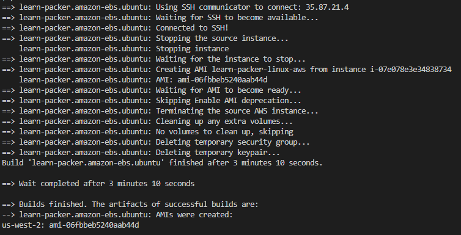
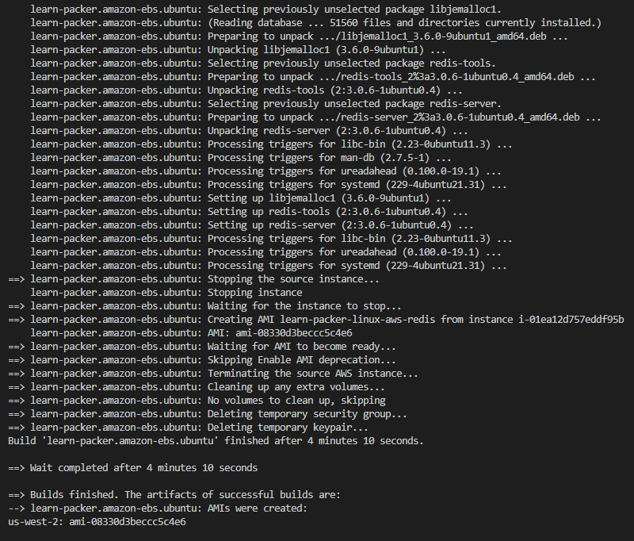
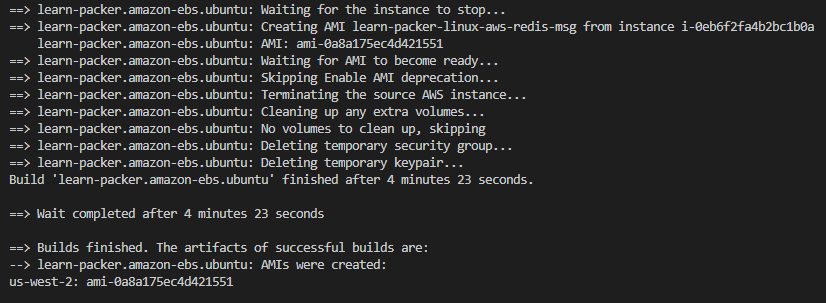

# Packer
All things Packer

Note: to follow along with this code, you must first configure your connection to AWS using `aws configure` providing your AWS CLI credentials, the default region, and a default output format (i.e us-east-1 and json).

Here is a link to the official Hashicorp Packer tutorials used in this repo: https://learn.hashicorp.com/collections/packer/aws-get-started

## Install Packer on Windows

Open PowerShell as an adminsitrator. Please make sure chocolatey is also installed - https://chocolatey.org/install.  

```
choco install packer
```

Mine is already installed and on the latest version.



YOu can also check if your package needs to be updated using `choco upgrade packer`. I usually verify it as well because sometimes Chocolately doesn't have the most recent packages, but it usually does. Still, it doesn't hurt to check (https://packer.io/downloads).

Refresh your environment variables to include any installed by Packer that may not be loaded.

```
refreshenv
```

You should get the following output:



Verify the installation was successful with the following command.

```
packer
```

You should get output like this (I switched from PowerShell to VSCode from this point on):



You have successfully installed Packer on your PC.

## Build an Image

The first step is creating a directory that will contain your Packer template, a configuration file that defines the image.

```
mkdir packer_tutorial
```

Navigate to the directory.

```
cd packer_tutorial
```

Create a file `aws-ubuntu.pkr.hcl` and add the following HCL block to it, then save.

```
packer {
  required_plugins {
    amazon = {
      version = ">= 0.0.2"
      source  = "github.com/hashicorp/amazon"
    }
  }
}

source "amazon-ebs" "ubuntu" {
  ami_name      = "learn-packer-linux-aws"
  instance_type = "t2.micro"
  region        = "us-west-2"
  source_ami_filter {
    filters = {
      name                = "ubuntu/images/*ubuntu-xenial-16.04-amd64-server-*"
      root-device-type    = "ebs"
      virtualization-type = "hvm"
    }
    most_recent = true
    owners      = ["099720109477"]
  }
  ssh_username = "ubuntu"
}

build {
  name    = "learn-packer"
  sources = [
    "source.amazon-ebs.ubuntu"
  ]
}
```

This template will create an AWS AMI from an EC2 Instance with the properties shown in the template. It uses the amazon plug-in with an EC2 Instance as the source to build an AMI named "learn-packer-linux-aws."

Next, initialize Packer within the packer_tutorial directory.

```
packer init .
```

If you haven't used this plugin before, you should get output after the command stated that the plugin has been installed.

Next, format and validate your Packer template.

```
packer fmt .
packer validate .
```



This will fix any formatting inconsistencies and validate the configuration of your template.

Now you can build your Packer image!

```
packer build aws-ubuntu-pkr.hcl
```

You should see it start to build your AMI and get confirmation like this:



You can now check your AMI using the AWS CLI or AWS Management Console. 

IMPORTANT! Packer does not manage your AMIs. SO if you need to delete them or any snapshots, make sure you do so on your own!!!

## Provisioner

Add the following code to your Packer template in the build block underneath sources:

```
provisioner "shell" {
  environment_vars = [
    "FOO=hello world",
  ]
  inline = [
    "echo Installing Redis",
    "sleep 30",
    "sudo apt-get update",
    "sudo apt-get install -y redis-server",
    "echo \"FOO is $FOO\" > example.txt",
  ]
}
```


Do a quick format and validate.

```
packer fmt .
packer validate .
```

AMI names must be unique, so you have to update the AMI name before building the image. I updated my name in the source block like this:

```
source "amazon-ebs" "ubuntu" {
  ami_name      = "learn-packer-linux-aws-redis"
```

Build the new Packer image with the added provisioner.

```
packer build aws-ubuntu.pkr.hcl
```

You should get output similar to this:



Now you can try adding more provisioners (again, with an updated name).

Name change:

```
source "amazon-ebs" "ubuntu" {
  ami_name      = "learn-packer-linux-aws-redis-msg"
```

And new build block:

```
build {
  name    = "learn-packer"
  sources = [
    "source.amazon-ebs.ubuntu"
  ]

  provisioner "shell" {
    environment_vars = [
      "FOO=hello world",
    ]
    inline = [
      "echo Installing Redis",
      "sleep 30",
      "sudo apt-get update",
      "sudo apt-get install -y redis-server",
      "echo \"FOO is $FOO\" > example.txt",
    ]
  }

  provisioner "shell" {
    inline = ["echo This provisioner runs last"]
  }
}
```

Build the new image.

```
packer build aws-ubuntu.pkr.hcl
```

You should get output similar to this:



CLEAN UP!!! Check your AMIs and Snapshots in your AWS account.