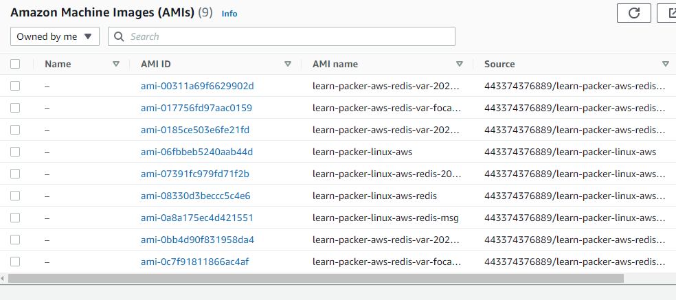
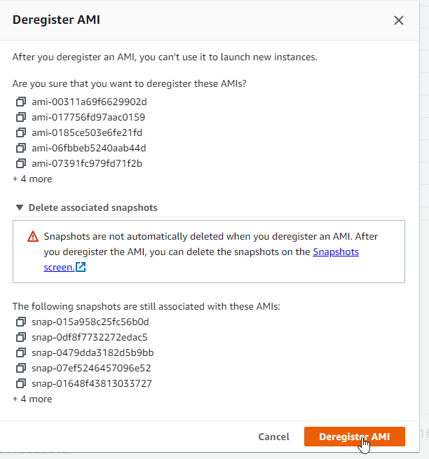
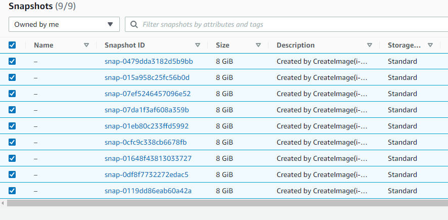
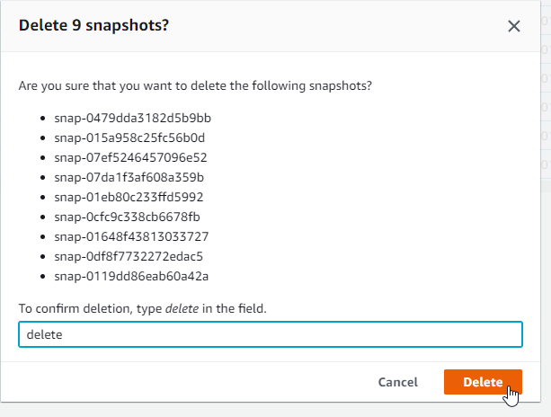

# Packer
All things Packer

Note: to follow along with this code, you must first configure your connection to AWS using `aws configure` providing your AWS CLI credentials, the default region, and a default output format (i.e us-east-1 and json).

Here is a link to the official Hashicorp Packer tutorials used in this repo: https://learn.hashicorp.com/collections/packer/aws-get-started

## Install Packer on Windows

Open PowerShell as an adminsitrator. Please make sure chocolatey is also installed - https://chocolatey.org/install.  

```
choco install packer
```

Mine is already installed and on the latest version.


YOu can also check if your package needs to be updated using `choco upgrade packer`. I usually verify it as well because sometimes Chocolately doesn't have the most recent packages, but it usually does. Still, it doesn't hurt to check (https://packer.io/downloads).

Refresh your environment variables to include any installed by Packer that may not be loaded.

```
refreshenv
```

You should get the following output:


Verify the installation was successful with the following command.

```
packer
```

You should get output like this (I switched from PowerShell to VSCode from this point on):


You have successfully installed Packer on your PC.

## Build an Image

The first step is creating a directory that will contain your Packer template, a configuration file that defines the image.

```
mkdir packer_tutorial
```

Navigate to the directory.

```
cd packer_tutorial
```

Create a file `aws-ubuntu.pkr.hcl` and add the following HCL block to it, then save.

```
packer {
  required_plugins {
    amazon = {
      version = ">= 0.0.2"
      source  = "github.com/hashicorp/amazon"
    }
  }
}

source "amazon-ebs" "ubuntu" {
  ami_name      = "learn-packer-linux-aws"
  instance_type = "t2.micro"
  region        = "us-west-2"
  source_ami_filter {
    filters = {
      name                = "ubuntu/images/*ubuntu-xenial-16.04-amd64-server-*"
      root-device-type    = "ebs"
      virtualization-type = "hvm"
    }
    most_recent = true
    owners      = ["099720109477"]
  }
  ssh_username = "ubuntu"
}

build {
  name    = "learn-packer"
  sources = [
    "source.amazon-ebs.ubuntu"
  ]
}
```

This template will create an AWS AMI from an EC2 Instance with the properties shown in the template. It uses the amazon plug-in with an EC2 Instance as the source to build an AMI named "learn-packer-linux-aws."

Next, initialize Packer within the packer_tutorial directory.

```
packer init .
```

If you haven't used this plugin before, you should get output after the command stated that the plugin has been installed.

Next, format and validate your Packer template.

```
packer fmt .
packer validate .
```


This will fix any formatting inconsistencies and validate the configuration of your template.

Now you can build your Packer image!

```
packer build aws-ubuntu-pkr.hcl
```

You should see it start to build your AMI and get confirmation like this:


You can now check your AMI using the AWS CLI or AWS Management Console. 

IMPORTANT! Packer does not manage your AMIs. SO if you need to delete them or any snapshots, make sure you do so on your own!!!

## Provisioners

Add the following code to your Packer template in the build block underneath sources:

```
provisioner "shell" {
  environment_vars = [
    "FOO=hello world",
  ]
  inline = [
    "echo Installing Redis",
    "sleep 30",
    "sudo apt-get update",
    "sudo apt-get install -y redis-server",
    "echo \"FOO is $FOO\" > example.txt",
  ]
}
```


Do a quick format and validate.

```
packer fmt .
packer validate .
```

AMI names must be unique, so you have to update the AMI name before building the image. I updated my name in the source block like this:

```
source "amazon-ebs" "ubuntu" {
  ami_name      = "learn-packer-linux-aws-redis"
```

Build the new Packer image with the added provisioner.

```
packer build aws-ubuntu.pkr.hcl
```

You should get output similar to this:


Now you can try adding more provisioners (again, with an updated name).

Name change:

```
source "amazon-ebs" "ubuntu" {
  ami_name      = "learn-packer-linux-aws-redis-msg"
```

And new build block:

```
build {
  name    = "learn-packer"
  sources = [
    "source.amazon-ebs.ubuntu"
  ]

  provisioner "shell" {
    environment_vars = [
      "FOO=hello world",
    ]
    inline = [
      "echo Installing Redis",
      "sleep 30",
      "sudo apt-get update",
      "sudo apt-get install -y redis-server",
      "echo \"FOO is $FOO\" > example.txt",
    ]
  }

  provisioner "shell" {
    inline = ["echo This provisioner runs last"]
  }
}
```

Build the new image.

```
packer build aws-ubuntu.pkr.hcl
```

You should get output similar to this:


## Variables

Add the following variable block to your Packer template (I put mine before the source):

```
variable "ami_prefix" {
  type    = string
  default = "learn-packer-linux-aws-redis"
}
```

You can also add local variables like this:

```
locals {
  timestamp = regex_replace(timestamp(), "[- TZ:]", "")
}
```

Now update your AMI name like this:

```
source "amazon-ebs" "ubuntu" {
  ami_name      = "${var.ami_prefix}-${local.timestamp}"
```

Build your new image.

```
packer build aws-ubuntu.pkr.hcl
```

There are two more vairable options. The first is the use of a variable file. Creat a file called `example.pkrvars.hcl` and add the following:

```
ami_prefix = "learn-packer-aws-redis-var"
```

Now you can build the image with a `--var-file` flag, like this:

```
packer build --var-file=example.pkrvars.hcl aws-ubuntu.pkr.hcl
```

You can see that Packer read the var file here:


Packer will also automatically load any variable file that matches the name `*.auto.pkrvars.hcl` without passing a parameter via the command line. You can try this by renaming the variable file.

```
mv example.pkrvars.hcl example.auto.pkrvars.hcl
```

Now build again and notice the name. This is a nice feature because you don't have to worry about the name being the same.

```
packer build .
```

Another option is passing the variable directly from the command line (which I would never do):

```
packer build --var ami_prefix=learn-packer-aws-redis-var-flag .
```

The important thing to understand with variables is the order of precedence. The order of ascending precendence is as follows:
1. variable defaults
2. environment variables
3. variable file(s)
4. command-line flag

## Parallel Builds

You can also build multiple AMIs in parallel from a single template. You could even build an AWS AMI and a VMware VM in parallel with the same scripts with near-identical images. Another great use case would be managing multiple environments (dev, test, prod) with the same template and separate AMIs.

Use the following code for your template:

```
packer {
  required_plugins {
    amazon = {
      version = ">= 0.0.1"
      source  = "github.com/hashicorp/amazon"
    }
  }
}

variable "ami_prefix" {
  type    = string
  default = "learn-packer-linux-aws-redis"
}

locals {
  timestamp = regex_replace(timestamp(), "[- TZ:]", "")
}

source "amazon-ebs" "ubuntu" {
  ami_name      = "${var.ami_prefix}-${local.timestamp}"
  instance_type = "t2.micro"
  region        = "us-west-2"
  source_ami_filter {
    filters = {
      name                = "ubuntu/images/*ubuntu-xenial-16.04-amd64-server-*"
      root-device-type    = "ebs"
      virtualization-type = "hvm"
    }
    most_recent = true
    owners      = ["099720109477"]
  }
  ssh_username = "ubuntu"
}

build {
  name    = "learn-packer"
  sources = [
    "source.amazon-ebs.ubuntu"
  ]

  provisioner "shell" {
    environment_vars = [
      "FOO=hello world",
    ]
    inline = [
      "echo Installing Redis",
      "sleep 30",
      "sudo apt-get update",
      "sudo apt-get install -y redis-server",
      "echo \"FOO is $FOO\" > example.txt",
    ]
  }

  provisioner "shell" {
    inline = ["echo This provisioner runs last"]
  }
}
```

To use parallel builds, create a source then add the source to the `sources` array in the build block. Add the following source block to your file:

```
source "amazon-ebs" "ubuntu-focal" {
  ami_name      = "${var.ami_prefix}-focal-${local.timestamp}"
  instance_type = "t2.micro"
  region        = "us-west-2"
  source_ami_filter {
    filters = {
      name                = "ubuntu/images/*ubuntu-focal-20.04-amd64-server-*"
      root-device-type    = "ebs"
      virtualization-type = "hvm"
    }
    most_recent = true
    owners      = ["099720109477"]
  }
  ssh_username = "ubuntu"
}
```

Then update your build block to use the new source.

```
build {
  name    = "learn-packer"
  sources = [
    "source.amazon-ebs.ubuntu",
    "source.amazon-ebs.ubuntu-focal"
  ]
```

Now build it.

```
packer build .
```

Notice it's building two images.


And now it's finished.

```
==> Wait completed after 6 minutes 29 seconds

==> Builds finished. The artifacts of successful builds are:
--> learn-packer.amazon-ebs.ubuntu: AMIs were created:
us-west-2: ami-0bb4d90f831958da4

--> learn-packer.amazon-ebs.ubuntu-focal: AMIs were created:
us-west-2: ami-0c7f91811866ac4af
```

## Post-Processors - Vagrant

The last step is to add a post-processing step to your Packer template.

Using the template you used last, you can add the following post-processor block inside the build block but after the provisioner step. These post-processor blocks will tag each image with the appropriate tags.

```
post-processor "vagrant" {}
```

It should look like this:

```
build {
  name    = "learn-packer"
  sources = [
    "source.amazon-ebs.ubuntu",
    "source.amazon-ebs.ubuntu-focal"
  ]

  provisioner "shell" {
    environment_vars = [
      "FOO=hello world",
    ]
    inline = [
      "echo Installing Redis",
      "sleep 30",
      "sudo apt-get update",
      "sudo apt-get install -y redis-server",
      "echo \"FOO is $FOO\" > example.txt",
    ]
  }

  provisioner "shell" {
    inline = ["echo This provisioner runs last"]
  }

  post-processor "vagrant" {}
}
```

Build your image and then list the files in your current directory. You should find Vagrant box files.

```
packer build .

ls -l
```

You can add as many post-processors as you want, but each one will start from the *original* artifact output by the builder, not the artifact created by a previously-declared post-processor. If you want to do that you have to use `post-processors` (plural) to make the output of one post-processor the input of another post-processor. For example, you could use the vagrant box files as an output from the first to then pass as input to compress them with a second.

```
post-processors {
  post-processor "vagrant" {}
  post-processor "compress" {}
}
```

## Clean Up

By now, you've probably created a whole bunch of AMI and Snapshots in your AWS account. 

**At this time I am telling you to delete them all so you don't get billed for the storage utilization.**

Log in to the AWS management console and delete all of the AMIs and Snapshots.

Here's a list of the AMIs I created (look for AMIs under the Images section on the left side of the EC2 console):



Select all of the AMIs, click the Actions drop down icon and select Deregister AMI. Notice you get a pop-up window that says you have to delete the snapshots separately.

I *really* wish Packer could do this for us...



After clicking the orange Deregister button you should see a message "You do not have any images in this Region." You might want to check your default region as well, as these were built in us-west-2 but I had a one-off AMI in us-east-1 as that is my default Region.

Now select Snapshots from the Elastic Block Store Section in the EC2 console.

You should have the same number of snapshots as you had AMIs



Select all the snaphots, click the Action drop down button, and select delete snapshots.



Type delete and click the orange Delete button. You should now have a message that says "You currently have no snapshots in this Region." Again, check your default Region (mine is us-east-1) to delete any snapshots there as well.

You have now complete the clean up section and thus, the all of the Packer tutorials!

